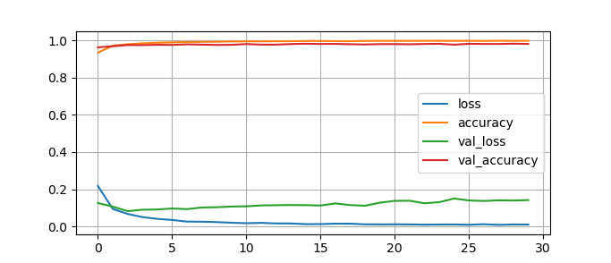

#Hand-written Numeric Image detection by Tensorflow
##Dataset
[MNIST Dataset](https://data.deepai.org/mnist.zip)
##Training
Here, the Dataset is trained on Tensorflow API and Having ~98% Accuracy
Following figure can describe you how it goes on Accuracy↑ and Loss↓

